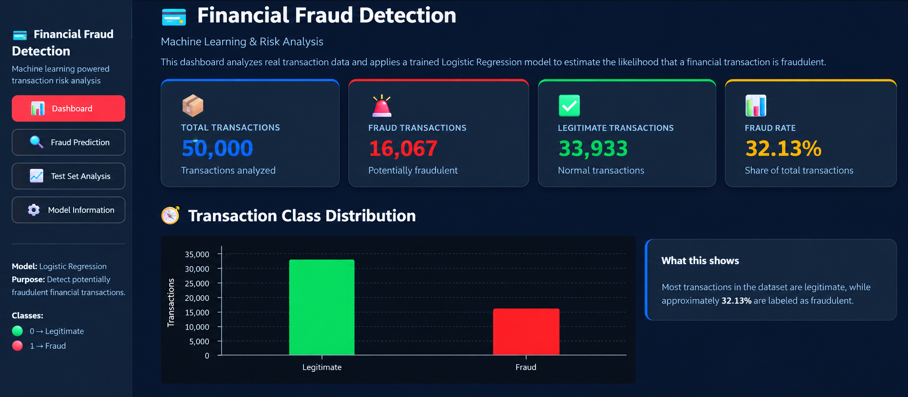
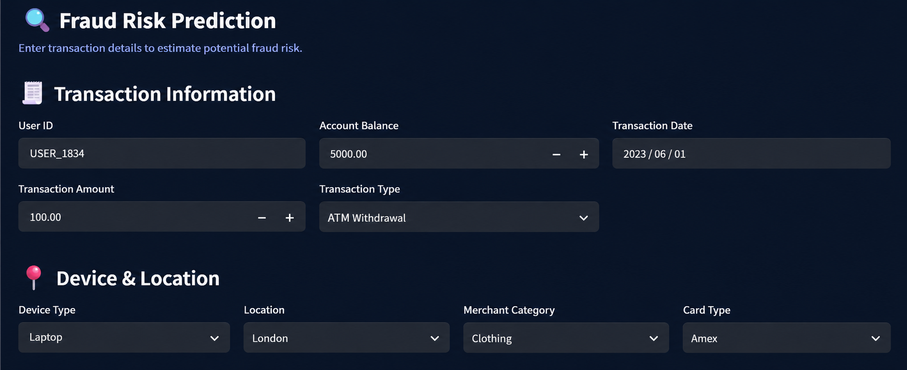
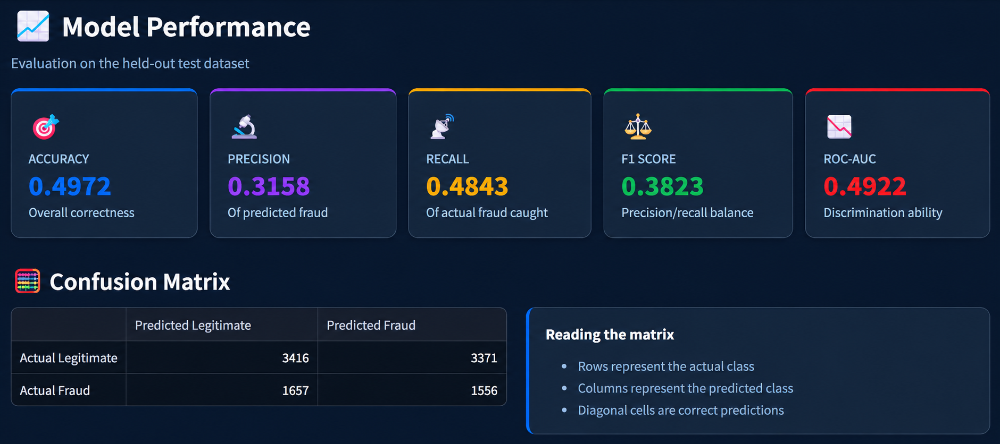
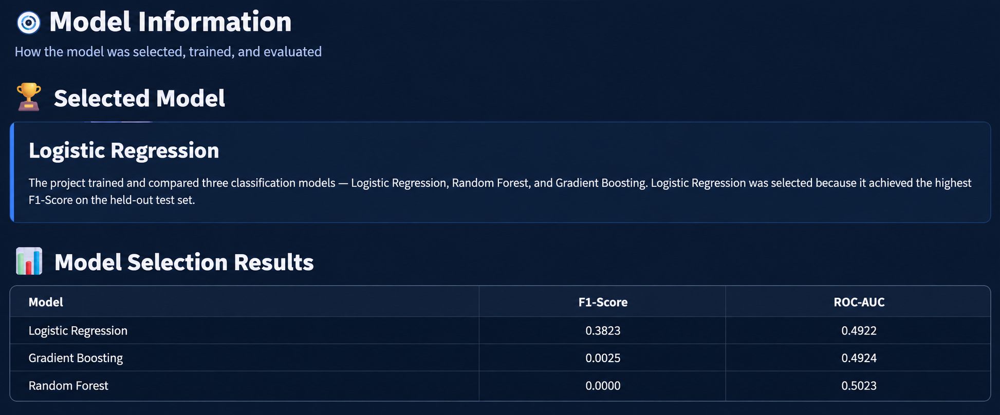

# 💳 Financial Fraud Detection and Risk Analysis


A machine learning-based application for detecting potentially fraudulent financial transactions and analyzing transaction risk through an interactive Streamlit dashboard.

The project covers the complete machine learning workflow, including data understanding, data cleaning, exploratory data analysis (EDA), feature engineering, preprocessing, model training, model evaluation, and interactive deployment.

---

## 📑 Table of Contents

- [📌 Project Overview](#-project-overview)
-  [🌐 Live Dashboard](#-live-dashboard)
- [🎯 Project Objectives](#-project-objectives)
- [📊 Dataset](#-dataset)
- [🔄 Machine Learning Workflow](#-machine-learning-workflow)
- [⚙️ Feature Engineering](#️-feature-engineering)
- [🔧 Data Preprocessing](#-data-preprocessing)
- [🤖 Machine Learning Models](#-machine-learning-models)
- [📈 Model Evaluation](#-model-evaluation)
- [⚠️ Known Limitations](#️-known-limitations)
- [🖥️ Streamlit Application](#️-streamlit-application)
- [📁 Project Structure](#-project-structure)
- [💻 Technologies Used](#-technologies-used)
- [🚀 Run Locally](#-run-locally)
- [🔮 Future Improvements](#-future-improvements)
- [👥 Contributors](#-contributors)
- [📄 License](#-license)
## 📌 Project Overview

Financial fraud detection is an important classification problem where the objective is to identify transactions that may be fraudulent based on transaction, account, device, location, merchant, and user-behavior information.

This project develops a binary classification system that predicts whether a transaction belongs to one of two classes:

- **0** → Legitimate Transaction
- **1** → Fraudulent Transaction

The trained model is integrated into a Streamlit dashboard where users can enter transaction details and receive a fraud-risk prediction.

---


## 🌐 Live Dashboard

<p align="center">
  <a href="https://financial-fraud-detection-b9qhgkecxc7cm89pla4tjl.streamlit.app/">
    
  </a>
</p>

---
## 🎯 Project Objectives

- Analyze financial transaction data and identify patterns related to fraudulent activity.
- Clean and prepare the dataset for machine learning.
- Perform exploratory data analysis (EDA).
- Engineer meaningful transaction and user-behavior features.
- Build and compare multiple classification models.
- Select the best-performing model based on F1-Score.
- Evaluate the selected model using classification metrics and a confusion matrix.
- Build an interactive Streamlit application for fraud-risk prediction.
- Provide a clear view of model performance and preprocessing information.

---

## 📊 Dataset

The project uses a synthetic financial transaction dataset.

### Dataset Size

| Category | Count |
|---|---|
| Total Transactions | 50,000 |
| Legitimate Transactions | 33,933 |
| Fraudulent Transactions | 16,067 |
| Fraud Rate | 32.13% |

### Dataset Classes

- **0** → Legitimate
- **1** → Fraud

### Dataset Attributes

The project works with transaction-level information such as:

- Transaction ID
- User ID
- Transaction amount
- Account balance
- Previous fraudulent activity
- Daily transaction count
- Card age
- Transaction date
- Transaction type
- Device type
- Location
- Merchant category
- Card type

### Dataset Files

```
data/
├── raw/
│   └── synthetic_fraud_dataset.csv
│
└── processed/
    ├── cleaned_fraud_dataset.csv
    ├── feature_engineered_fraud_dataset.csv
    ├── X_train.csv
    ├── X_test.csv
    ├── y_train.csv
    └── y_test.csv
```

---

## 🔄 Machine Learning Workflow

```
Raw Dataset
     ↓
Data Understanding
     ↓
Data Cleaning
     ↓
Exploratory Data Analysis
     ↓
Feature Engineering
     ↓
Train/Test Split
     ↓
Preprocessing
     ↓
Model Training
     ↓
Model Comparison
     ↓
Model Evaluation
     ↓
Streamlit Deployment
```

---

## ⚙️ Feature Engineering

Several additional features were created to capture transaction patterns, temporal information, and user behavior.

### 📅 Date Features

The transaction date is converted into:

- Year
- Month
- Day
- Day_of_Week

### 💰 Transaction Amount Binning

Transactions are grouped into amount categories:

| Category | Range |
|---|---|
| micro | 0–10 |
| low | 10–50 |
| medium | 50–100 |
| high | 100–250 |
| very_high | 250–500 |
| extreme | Above 500 |

### ⚖️ Balance-to-Amount Ratio

A ratio is calculated between account balance and transaction amount:

```
Balance_to_Amount_Ratio = Account_Balance / Transaction_Amount
```

Zero and invalid values are handled before the feature is passed to the model.

### 👤 User Behavior Features

User-level transaction behavior is captured using:

- User_Transaction_Count
- User_Avg_Transaction_Amount
- User_Total_Transaction_Amount
- User_Amount_Deviation

These features provide additional context about how a transaction compares with the user's transaction history within the available dataset.

---

## 🔧 Data Preprocessing

The preprocessing pipeline treats numerical and categorical features separately.

### Numerical Features

```
Numerical Features
       │
       ▼
Median Imputation
       │
       ▼
StandardScaler
```

The numerical features include:

- Transaction_Amount
- Account_Balance
- Previous_Fraudulent_Activity
- Daily_Transaction_Count
- Card_Age
- Year
- Month
- Day
- Day_of_Week
- Balance_to_Amount_Ratio
- User_Transaction_Count
- User_Avg_Transaction_Amount
- User_Total_Transaction_Amount
- User_Amount_Deviation

### Categorical Features

```
Categorical Features
       │
       ▼
Most-Frequent Imputation
       │
       ▼
One-Hot Encoding
```

The categorical features include:

- Transaction_Type
- Device_Type
- Location
- Merchant_Category
- Card_Type
- Amount_Bin

The preprocessing pipeline is saved and reused by the Streamlit application so that prediction inputs undergo the same transformation process used during model development.

---

## 🤖 Machine Learning Models

Three classification algorithms were trained and compared:

- Logistic Regression
- Random Forest
- Gradient Boosting

The models were compared primarily using F1-Score and ROC-AUC.

### Model Comparison

| Model | F1-Score | ROC-AUC |
|---|---|---|
| Logistic Regression | 0.3823 | 0.4922 |
| Gradient Boosting | 0.0025 | 0.4924 |
| Random Forest | 0.0000 | 0.5023 |

### Selected Model

Logistic Regression was selected because it achieved the highest F1-Score among the evaluated models.

The trained model is stored as:

```
models/best_fraud_model.joblib
```

The preprocessing pipeline is stored as:

```
models/preprocessor.joblib
```

---

## 📈 Model Evaluation

The selected Logistic Regression model was evaluated on the held-out test dataset.

### Test Set Results

| Metric | Score |
|---|---|
| Accuracy | 0.4972 |
| Precision | 0.3158 |
| Recall | 0.4843 |
| F1-Score | 0.3823 |
| ROC-AUC | 0.4922 |

### Confusion Matrix

The application provides a confusion matrix to show how the model classified legitimate and fraudulent transactions.

The matrix includes:

- True Negatives
- False Positives
- False Negatives
- True Positives

This helps analyze the types of classification errors made by the model.

---
## ⚠️ Known Limitations

- **Model Performance:** The selected Logistic Regression model achieved an F1-Score of **0.3823** and ROC-AUC of **0.4922**, indicating limited predictive performance.
- **Synthetic Dataset:** The project uses synthetic data, which may not fully represent real-world financial fraud patterns.
- **Generalization:** Results may not generalize to real financial institutions or unseen transaction patterns.
- **Production Readiness:** This application is for educational and demonstration purposes and is not production-ready.
- **Explainability & Monitoring:** Advanced explainability, real-time monitoring, model drift detection, and automated retraining are not currently implemented.

---
## 🖥️ Streamlit Application

The trained model and preprocessing pipeline are integrated into an interactive Streamlit application.

### Application Pages

#### 1. 📊 Dashboard
<p align="center">
  
</p>

The Dashboard provides a high-level overview of the dataset.

It displays:

- Total transactions
- Fraud transactions
- Legitimate transactions
- Fraud rate
- Transaction class distribution
  
#### 2. 🔍 Fraud Prediction
<p align="center">
  
</p>

The Fraud Prediction page allows users to enter transaction information.

Input fields include:

- User ID
- Account Balance
- Transaction Date
- Transaction Amount
- Transaction Type
- Device Type
- Location
- Merchant Category
- Card Type
- Previous Fraudulent Activity
- Daily Transaction Count
- Card Age

The application then:

```
User Input
    ↓
Feature Creation
    ↓
Preprocessing Pipeline
    ↓
Trained Logistic Regression Model
    ↓
Prediction Probability
    ↓
Fraud Risk Result
```

#### 3. 📈 Test Set Analysis
<p align="center">
  
</p>
This page presents the performance of the selected model on the held-out test dataset.

It includes:

- Accuracy
- Precision
- Recall
- F1-Score
- ROC-AUC
- Confusion Matrix
- Prediction Breakdown

#### 4. 🤖 Model Information
<p align="center">
  
</p>

This page explains:

- Selected model
- Model selection results
- Feature engineering
- Preprocessing pipeline
- Numerical features
- Categorical features
- Model features


---
## 📁 Project Structure

```text
financial-fraud-detection/
│
├── app.py
├── README.md
├── LICENSE
├── requirements.txt
├── .gitignore
│
├── data/
│   ├── raw/
│   │   └── synthetic_fraud_dataset.csv
│   │
│   └── processed/
│       ├── cleaned_fraud_dataset.csv
│       ├── feature_engineered_fraud_dataset.csv
│       ├── X_train.csv
│       ├── X_test.csv
│       ├── y_train.csv
│       └── y_test.csv
│
├── images/
│   ├── dashboard.png
│   ├── fraud_prediction.png
│   ├── test_set_analysis.png
│   └── model_information.png
│
├── models/
│   ├── best_fraud_model.joblib
│   └── preprocessor.joblib
│
└── notebooks/
    ├── Data Understanding.ipynb
    ├── Data Cleaning & EDA.ipynb
    ├── Feature Engineering.ipynb
    ├── ML Preparation.ipynb
    ├── Model Training.ipynb
    └── Model Evaluation.ipynb

```
---

## 💻 Technologies Used

- Python
- Pandas
- NumPy
- Scikit-learn
- Joblib
- Streamlit
- Jupyter Notebook
- Machine Learning
  - Logistic Regression
  - Random Forest
  - Gradient Boosting
- One-Hot Encoding
- Standard Scaling
- Median/Most-Frequent Imputation
- Classification metrics
- Confusion Matrix
- ROC-AUC

---

## 🚀 Run Locally

**1. Clone the Repository**

```bash
git clone https://github.com/nasrin567/financial-fraud-detection.git
```

**2. Navigate to the Project Directory**

```bash
cd financial-fraud-detection
```

**3. Create a Virtual Environment**

```bash
python -m venv .venv
```

**4. Activate the Virtual Environment**

Windows PowerShell:

```bash
.venv\Scripts\Activate.ps1
```

**5. Install Dependencies**

```bash
pip install -r requirements.txt
```

**6. Run the Streamlit Application**

```bash
python -m streamlit run app.py
```

The application will open in your browser.

---

## 🔮 Future Improvements

Potential improvements include:

- Improve training data quality and representativeness.
- Use more realistic financial transaction datasets.
- Perform extensive hyperparameter tuning.
- Explore additional classification algorithms.
- Apply appropriate class-imbalance handling techniques.
- Perform feature selection.
- Analyze feature importance.
- Optimize the classification threshold.
- Improve probability calibration.
- Add model explainability using techniques such as SHAP.
- Introduce time-based validation for transaction data.
- Add model monitoring and performance tracking.
- Improve production deployment and security.

---

## 👥 Contributors

- [Nasrin Khatoon](https://github.com/nasrin567)
- [Pinkey Kavar Bika](https://github.com/pinkey-kavar-bika)
- [Sheikh Moin](https://github.com/sheikhmoin-09)


---

# 📄 License

This project is licensed under the MIT License.

---

# ⭐ Support

If you found this project useful, consider giving it a ⭐ on GitHub.

